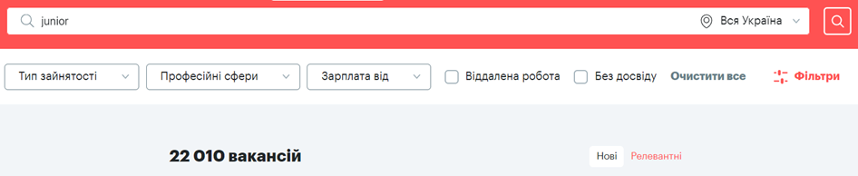
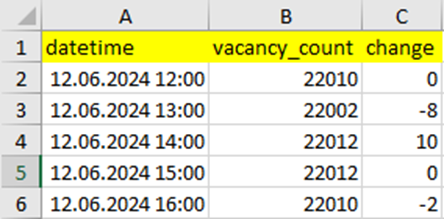

# Test-task-for-the-position-of-Junior-Python-Developer

# Тестове завдання на позицію Junior Python Developer

Частина 1. Реалізувати парсер кількості вакансій на сайті robota.ua за ключовим словом "junior".
•	Реалізуйте парсер, який щогодини отримує кількість актуальних вакансій з сайту robota.ua за ключовим словом "junior". Використовуйте requests або selenium. У разі використання selenium заборонено використовувати імена класів для пошуку елементів.

 
•	Створіть базу даних SQLite, де зберігатиметься історія запитів з часом парсингу та кількістю вакансій. Підключення до SQLite реалізуйте через SQLAlchemy або sqlite3.

# Частина 2. Реалізувати телеграм-бот для отримання статистики вакансій.
•	Використовуючи aiogram, створіть телеграм-бота, який у відповідь на команду /get_today_statistic буде отримувати записи з бази даних за актуальну дату, формувати з них Excel-файл зі звітом та надсилати цей файл користувачу. Приклад звіту:

# Загальні вимоги.
•	Обидві частини проекту мають запускатись разом та працювати асинхронно.
•	Забезпечте належну документацію для встановлення залежностей та запуску проекту.
